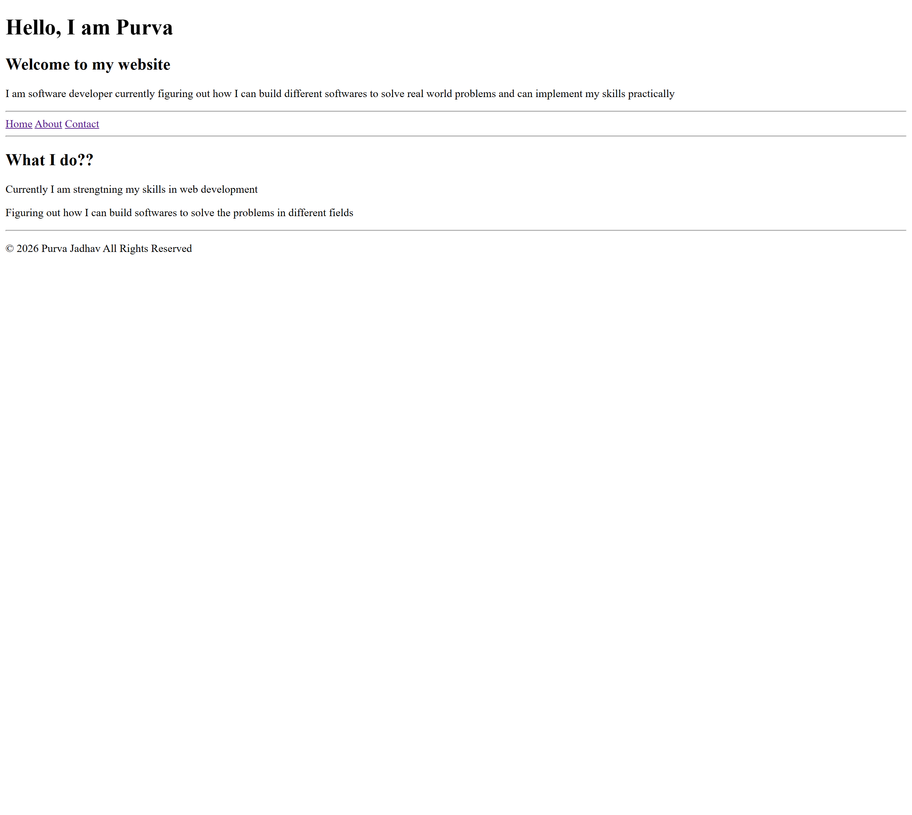
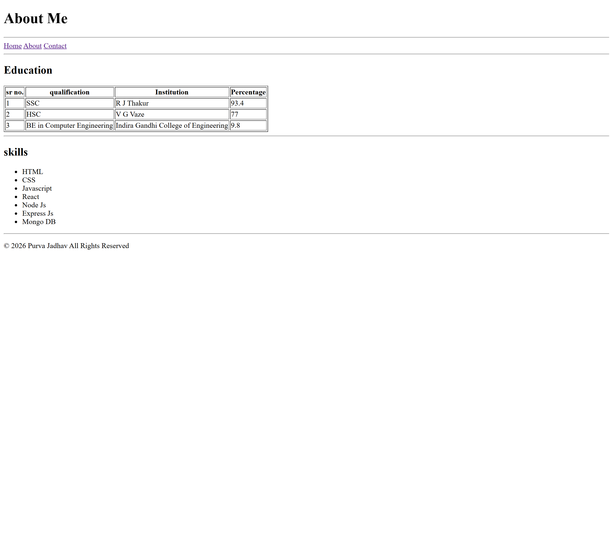
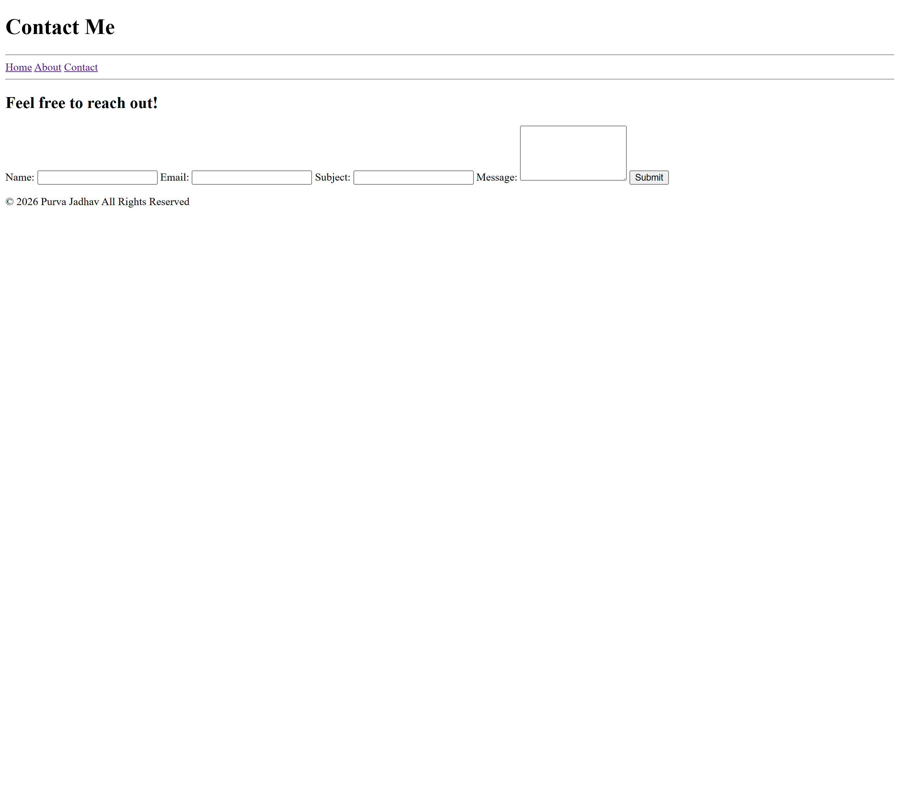

# Purva Jadhav — Multipage Personal Website

A simple multipage personal website built using pure HTML.  
It includes Home, About, and Contact pages to showcase profile, education, skills, and a contact form.

---

## 🌐 Live Demo
[View Live Site](https://multipagelayout.netlify.app/)

---

## 📸 Screenshot




---

## 📖 About This Project
This project is a clean and structured multipage website built using only HTML5.  
The main goal was to understand how multiple pages are connected using navigation links and to practice writing semantic and accessible HTML.

---

## 🛠 Built With
- HTML5 (pure — no CSS, no JavaScript)

---

## ✨ Features
- Multipage layout (Home, About, Contact)
- Semantic HTML structure (header, main, section, footer, nav)
- Navigation bar for linking pages
- Education table with qualifications and marks
- Skills list using unordered list
- Contact form with input fields and labels
- Clean and readable HTML code

---

## 🚀 Usage
1. Clone this repository  
   ```bash
   git clone https://github.com/Purvjadh/Multipage-Layout-using-HTML-only
   ```

2. Open the project folder  

3. Open `index.html` in your browser  

4. Navigate through pages using the menu  

---

## 📚 Learning Outcomes
- Understanding multipage website structure  
- Linking pages using anchor (`<a>`) tags  
- Writing semantic HTML elements  
- Creating forms with labels and inputs  
- Building tables to display structured data  
- Organizing content using lists  
- Writing clean and properly indented HTML  

---

## 👩‍💻 Author
Purva Jadhav  
- LinkedIn: https://www.linkedin.com/in/purva-jadhav-5590572b4 
- GitHub: https://github.com/Purvjadh
